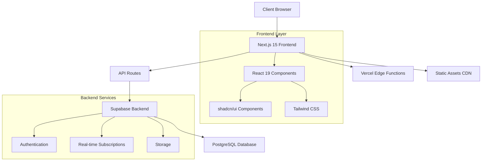
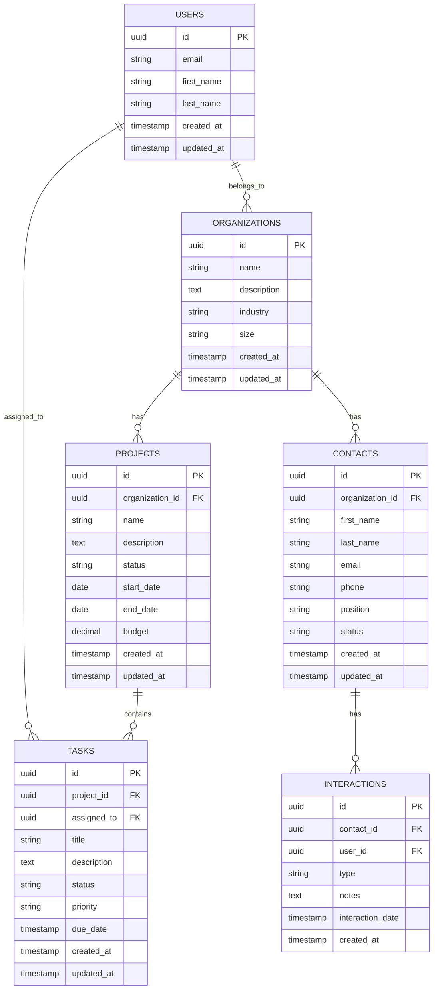
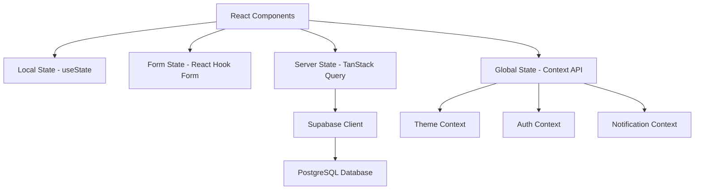
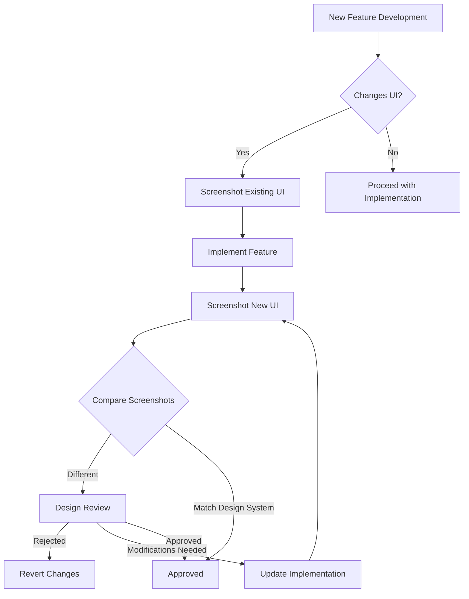
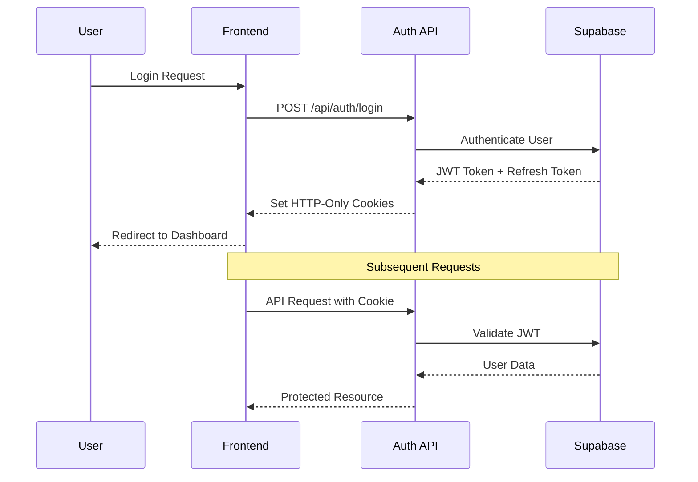

# Unite Group CRM Platform - Design Documentation

## System Architecture Overview

### High-Level Architecture


### Technology Stack Rationale

#### Frontend Framework: Next.js 15
**Decision**: Next.js 15 with App Router
**Rationale**: 
- Server-side rendering for SEO optimization
- Built-in API routes for backend functionality
- Excellent TypeScript support
- Vercel deployment optimization
- React 19 compatibility for latest features

#### UI Component System: shadcn/ui
**Decision**: shadcn/ui over other component libraries
**Rationale**:
- Copy-paste approach allows full customization
- Built on Radix UI primitives for accessibility
- Tailwind CSS integration for consistent styling
- TypeScript-first design
- Active community and regular updates

#### Styling: Tailwind CSS 4.x
**Decision**: Tailwind CSS with utility-first approach
**Rationale**:
- Rapid development with utility classes
- Consistent design system
- Excellent tree-shaking for production
- Dark mode support built-in
- Mobile-first responsive design

#### Backend: Supabase
**Decision**: Supabase over custom backend
**Rationale**:
- PostgreSQL database with real-time capabilities
- Built-in authentication and authorization
- Row Level Security (RLS) for data protection
- Real-time subscriptions for live updates
- Excellent Next.js integration

## Component Architecture Design

### Component Hierarchy
```
src/components/
├── ui/                     # shadcn/ui components
│   ├── button.tsx
│   ├── input.tsx
│   ├── form.tsx
│   └── ...
├── layout/                 # Layout components
│   ├── header.tsx
│   ├── sidebar.tsx
│   ├── footer.tsx
│   └── navigation.tsx
├── forms/                  # Form components
│   ├── auth/
│   ├── contact/
│   └── crm/
├── dashboard/              # Dashboard-specific components
│   ├── metrics/
│   ├── charts/
│   └── widgets/
├── crm/                    # CRM-specific components
│   ├── contacts/
│   ├── projects/
│   ├── tasks/
│   └── organizations/
└── common/                 # Shared components
    ├── loading.tsx
    ├── error-boundary.tsx
    └── theme-provider.tsx
```

### Design Patterns

#### 1. Compound Component Pattern
**Usage**: Complex UI components like forms and data tables
**Example**:
```tsx
<Form>
  <Form.Field>
    <Form.Label>Email</Form.Label>
    <Form.Input type="email" />
    <Form.Error />
  </Form.Field>
  <Form.Submit>Submit</Form.Submit>
</Form>
```

#### 2. Render Props Pattern
**Usage**: Data fetching and state management
**Example**:
```tsx
<DataFetcher url="/api/contacts">
  {({ data, loading, error }) => (
    loading ? <Loading /> : 
    error ? <Error message={error} /> :
    <ContactList contacts={data} />
  )}
</DataFetcher>
```

#### 3. Provider Pattern
**Usage**: Theme, authentication, and global state
**Example**:
```tsx
<ThemeProvider>
  <AuthProvider>
    <QueryProvider>
      <App />
    </QueryProvider>
  </AuthProvider>
</ThemeProvider>
```

## Database Schema Design

### Entity Relationship Diagram


### Database Design Principles

#### 1. Normalization
- Third Normal Form (3NF) compliance
- Minimize data redundancy
- Ensure data integrity through foreign keys

#### 2. Scalability Considerations
- UUID primary keys for distributed systems
- Indexed columns for frequent queries
- Partitioning strategy for large tables

#### 3. Security Design
- Row Level Security (RLS) policies
- User-based data isolation
- Audit trails for sensitive operations

## API Design Architecture

### RESTful API Structure
```
/api/
├── auth/
│   ├── login
│   ├── register
│   ├── logout
│   └── refresh
├── organizations/
│   ├── GET    /api/organizations
│   ├── POST   /api/organizations
│   ├── GET    /api/organizations/[id]
│   ├── PUT    /api/organizations/[id]
│   └── DELETE /api/organizations/[id]
├── projects/
│   ├── GET    /api/projects
│   ├── POST   /api/projects
│   ├── GET    /api/projects/[id]
│   ├── PUT    /api/projects/[id]
│   └── DELETE /api/projects/[id]
├── contacts/
│   ├── GET    /api/contacts
│   ├── POST   /api/contacts
│   ├── GET    /api/contacts/[id]
│   ├── PUT    /api/contacts/[id]
│   └── DELETE /api/contacts/[id]
└── tasks/
    ├── GET    /api/tasks
    ├── POST   /api/tasks
    ├── GET    /api/tasks/[id]
    ├── PUT    /api/tasks/[id]
    └── DELETE /api/tasks/[id]
```

### API Response Format
```typescript
interface ApiResponse<T> {
  success: boolean;
  data?: T;
  error?: {
    code: string;
    message: string;
    details?: any;
  };
  pagination?: {
    page: number;
    limit: number;
    total: number;
    totalPages: number;
  };
}
```

### Error Handling Strategy
```typescript
enum ErrorCodes {
  VALIDATION_ERROR = 'VALIDATION_ERROR',
  UNAUTHORIZED = 'UNAUTHORIZED',
  FORBIDDEN = 'FORBIDDEN',
  NOT_FOUND = 'NOT_FOUND',
  INTERNAL_ERROR = 'INTERNAL_ERROR',
  RATE_LIMITED = 'RATE_LIMITED'
}
```

## State Management Design

### Client State Architecture


### State Management Patterns

#### 1. Server State (TanStack Query)
**Usage**: API data fetching and caching
```typescript
const useContacts = () => {
  return useQuery({
    queryKey: ['contacts'],
    queryFn: () => fetchContacts(),
    staleTime: 5 * 60 * 1000, // 5 minutes
  });
};
```

#### 2. Form State (React Hook Form + Zod)
**Usage**: Form validation and submission
```typescript
const contactSchema = z.object({
  firstName: z.string().min(1, 'First name is required'),
  lastName: z.string().min(1, 'Last name is required'),
  email: z.string().email('Invalid email address'),
});

const useContactForm = () => {
  return useForm<ContactFormData>({
    resolver: zodResolver(contactSchema),
  });
};
```

#### 3. Global State (Context API)
**Usage**: Theme, authentication, notifications
```typescript
interface AppContextType {
  theme: 'light' | 'dark' | 'system';
  user: User | null;
  notifications: Notification[];
}
```

## UI/UX Design System

### Design Tokens
```typescript
const designTokens = {
  colors: {
    primary: {
      50: '#f0f9ff',
      500: '#3b82f6',
      900: '#1e3a8a',
    },
    gray: {
      50: '#f9fafb',
      500: '#6b7280',
      900: '#111827',
    },
  },
  spacing: {
    xs: '0.25rem',
    sm: '0.5rem',
    md: '1rem',
    lg: '1.5rem',
    xl: '2rem',
  },
  typography: {
    fontFamily: {
      sans: ['Inter', 'system-ui', 'sans-serif'],
      mono: ['JetBrains Mono', 'monospace'],
    },
    fontSize: {
      xs: '0.75rem',
      sm: '0.875rem',
      base: '1rem',
      lg: '1.125rem',
      xl: '1.25rem',
    },
  },
};
```

## Design Preservation Strategy

### Core Principles
```typescript
const designPreservationPrinciples = {
  stabilityFirst: "Maintain existing design aesthetic and layout as a fundamental requirement",
  enhancementOnly: "Add features without altering established design elements",
  strictConsistency: "New components must adhere to existing design patterns",
  documentedChanges: "All visual modifications require thorough documentation and approval"
}
```

### Visual Regression Prevention


### Component Extension Guidelines
```typescript
// Extend existing components rather than replacing them
// Example: Button extension with new capability while preserving appearance
interface ExtendedButtonProps extends ButtonProps {
  newFeature?: boolean;
}

const ExtendedButton = ({ newFeature, ...buttonProps }: ExtendedButtonProps) => {
  // Preserve all existing button styling and behavior
  return (
    <Button 
      {...buttonProps} 
      // Only add new functionality without changing appearance
      onClick={(e) => {
        if (newFeature) {
          // Add new behavior
        }
        // Preserve original behavior
        buttonProps.onClick?.(e);
      }}
    />
  );
};
```

### Component Development Rules
1. **No Replacement**: Never replace existing components, only extend them
2. **Theme Adherence**: Use existing design tokens for all styling
3. **Responsive Consistency**: Maintain same responsive behavior as existing components
4. **Accessibility Preservation**: Maintain or improve accessibility, never reduce it
5. **Visual Testing**: All UI changes require visual regression tests
6. **Documentation**: Update design documentation with any approved changes

### Component Variants
```typescript
const buttonVariants = cva(
  "inline-flex items-center justify-center rounded-md text-sm font-medium transition-colors",
  {
    variants: {
      variant: {
        default: "bg-primary text-primary-foreground hover:bg-primary/90",
        destructive: "bg-destructive text-destructive-foreground hover:bg-destructive/90",
        outline: "border border-input hover:bg-accent hover:text-accent-foreground",
        secondary: "bg-secondary text-secondary-foreground hover:bg-secondary/80",
        ghost: "hover:bg-accent hover:text-accent-foreground",
        link: "underline-offset-4 hover:underline text-primary",
      },
      size: {
        default: "h-10 py-2 px-4",
        sm: "h-9 px-3 rounded-md",
        lg: "h-11 px-8 rounded-md",
        icon: "h-10 w-10",
      },
    },
    defaultVariants: {
      variant: "default",
      size: "default",
    },
  }
);
```

### Responsive Design Strategy
```typescript
const breakpoints = {
  sm: '640px',
  md: '768px',
  lg: '1024px',
  xl: '1280px',
  '2xl': '1536px',
};

// Mobile-first approach
const responsiveClasses = {
  container: 'w-full px-4 sm:px-6 lg:px-8',
  grid: 'grid grid-cols-1 md:grid-cols-2 lg:grid-cols-3',
  text: 'text-sm sm:text-base lg:text-lg',
};
```

## Security Architecture

### Authentication Flow


### Authorization Strategy
```typescript
enum UserRole {
  ADMIN = 'admin',
  MANAGER = 'manager',
  USER = 'user',
}

enum Permission {
  READ_CONTACTS = 'read:contacts',
  WRITE_CONTACTS = 'write:contacts',
  DELETE_CONTACTS = 'delete:contacts',
  MANAGE_USERS = 'manage:users',
}

const rolePermissions: Record<UserRole, Permission[]> = {
  [UserRole.ADMIN]: [
    Permission.READ_CONTACTS,
    Permission.WRITE_CONTACTS,
    Permission.DELETE_CONTACTS,
    Permission.MANAGE_USERS,
  ],
  [UserRole.MANAGER]: [
    Permission.READ_CONTACTS,
    Permission.WRITE_CONTACTS,
  ],
  [UserRole.USER]: [
    Permission.READ_CONTACTS,
  ],
};
```

### Data Protection
```sql
-- Row Level Security Policy Example
CREATE POLICY "Users can only see their organization's data" ON contacts
  FOR ALL USING (
    organization_id IN (
      SELECT organization_id 
      FROM user_organizations 
      WHERE user_id = auth.uid()
    )
  );
```

## Performance Optimization Design

### Caching Strategy
```typescript
const cacheConfig = {
  // Browser caching
  staticAssets: {
    maxAge: '1y',
    immutable: true,
  },
  
  // API response caching
  apiResponses: {
    contacts: '5m',
    projects: '10m',
    dashboard: '1m',
  },
  
  // Database query caching
  database: {
    enabled: true,
    ttl: 300, // 5 minutes
  },
};
```

### Code Splitting Strategy
```typescript
// Route-based splitting
const Dashboard = lazy(() => import('./pages/Dashboard'));
const Contacts = lazy(() => import('./pages/Contacts'));
const Projects = lazy(() => import('./pages/Projects'));

// Component-based splitting
const DataTable = lazy(() => import('./components/DataTable'));
const Chart = lazy(() => import('./components/Chart'));
```

### Bundle Optimization
```javascript
// next.config.js
module.exports = {
  experimental: {
    optimizeCss: true,
    optimizePackageImports: ['lucide-react', '@radix-ui/react-icons'],
  },
  compiler: {
    removeConsole: process.env.NODE_ENV === 'production',
  },
};
```

## Monitoring and Observability

### Error Tracking
```typescript
interface ErrorContext {
  userId?: string;
  organizationId?: string;
  route: string;
  userAgent: string;
  timestamp: Date;
  stackTrace: string;
}

const logError = (error: Error, context: ErrorContext) => {
  // Send to monitoring service
  console.error('Application Error:', {
    message: error.message,
    stack: error.stack,
    context,
  });
};
```

### Performance Metrics
```typescript
const performanceMetrics = {
  // Core Web Vitals
  LCP: 'Largest Contentful Paint',
  FID: 'First Input Delay',
  CLS: 'Cumulative Layout Shift',
  
  // Custom metrics
  TTI: 'Time to Interactive',
  FCP: 'First Contentful Paint',
  API_RESPONSE_TIME: 'API Response Time',
};
```

## Deployment Architecture

### Vercel Deployment Strategy
```yaml
# vercel.json
{
  "framework": "nextjs",
  "buildCommand": "npm run build",
  "devCommand": "npm run dev",
  "installCommand": "npm install",
  "functions": {
    "src/app/api/**/*.ts": {
      "maxDuration": 30
    }
  },
  "headers": [
    {
      "source": "/api/(.*)",
      "headers": [
        {
          "key": "Cache-Control",
          "value": "s-maxage=60, stale-while-revalidate"
        }
      ]
    }
  ]
}
```

### Environment Configuration
```typescript
const config = {
  development: {
    apiUrl: 'http://localhost:3000/api',
    supabaseUrl: process.env.NEXT_PUBLIC_SUPABASE_URL,
    logLevel: 'debug',
  },
  production: {
    apiUrl: 'https://unite-group.vercel.app/api',
    supabaseUrl: process.env.NEXT_PUBLIC_SUPABASE_URL,
    logLevel: 'error',
  },
};
```

---

*Design decisions based on Context7 research and Sequential Thinking analysis*
*Last Updated: May 24, 2025*
*Architecture optimized for Next.js 15 + React 19 + shadcn/ui stack*
