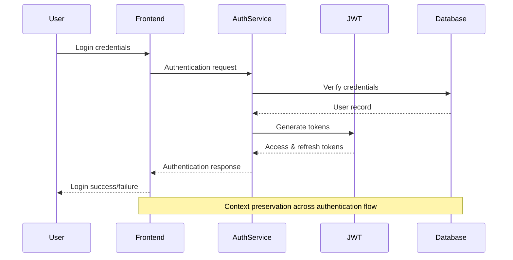
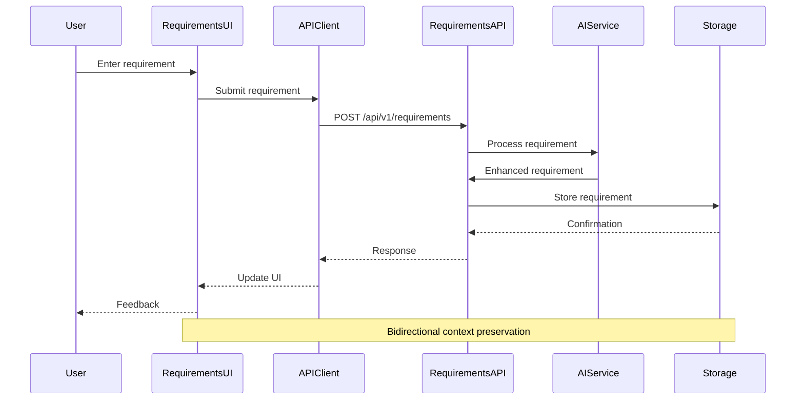
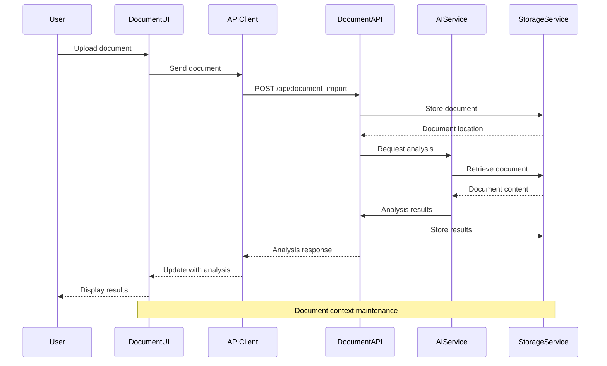
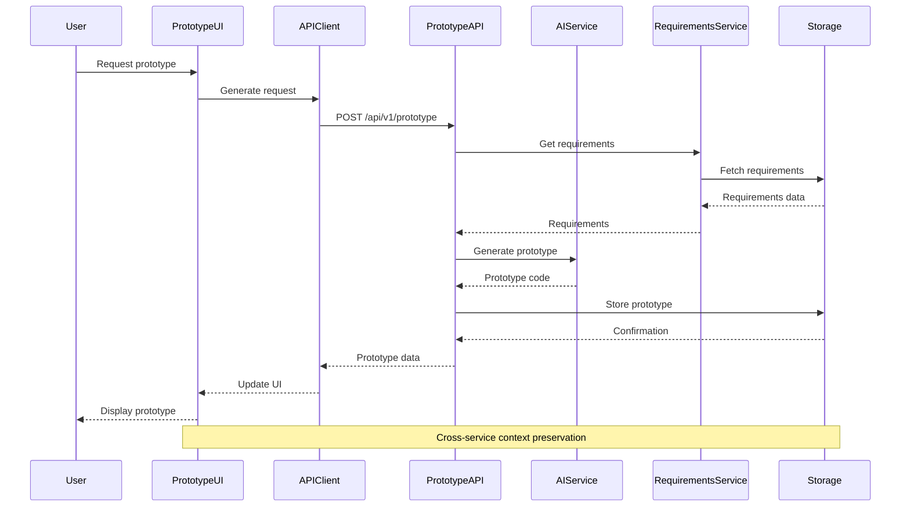
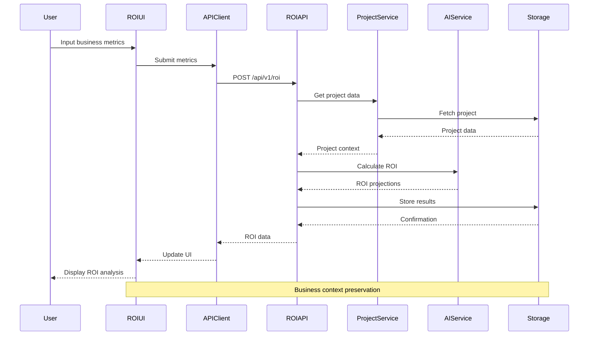

# Data Flow Verification for Auto AGI Builder

This document provides a comprehensive verification of data flows throughout the Auto AGI Builder application, using Context 7 methodology to ensure robust end-to-end data integrity and management.

## Table of Contents

- [Introduction](#introduction)
- [Core Data Flows](#core-data-flows)
- [End-to-End Data Flow Verification](#end-to-end-data-flow-verification)
- [Data Integrity Points](#data-integrity-points)
- [Error Handling in Data Flows](#error-handling-in-data-flows)
- [Context 7 Data Management](#context-7-data-management)
- [Verification Procedures](#verification-procedures)
- [Common Issues and Resolutions](#common-issues-and-resolutions)

## Introduction

Data flow verification is a critical component of the Auto AGI Builder application, ensuring that information moves correctly between system components. This verification process uses Context 7 methodology to analyze data flows across different environments, interfaces, and states.

## Core Data Flows

The Auto AGI Builder application has several critical data flows that form the backbone of the system:

### 1. User Authentication Flow



### 2. Requirements Capture Flow



### 3. Document Analysis Flow



### 4. Prototype Generation Flow



### 5. ROI Calculation Flow



## End-to-End Data Flow Verification

To ensure data integrity throughout the application, we've implemented a systematic verification process:

### Authentication Context Verification

The authentication system maintains user context across the entire application:

1. **Token management**: JWT tokens are properly validated on every API request
2. **Permission enforcement**: Role-based access control is consistently applied
3. **Session maintenance**: Refresh token rotation is properly implemented

### Project Context Preservation

Project data context is maintained across all project-related services:

1. **Project metadata**: Core project information is consistently available
2. **Requirements context**: Requirements are properly associated with projects
3. **User permissions**: Project access controls are enforced across all services

### Cross-Service Data Integrity

Data integrity is verified across different services:

1. **Requirements → Prototype**: Requirements data is correctly used in prototype generation
2. **Documents → Requirements**: Document analysis results properly feed into requirements
3. **Project → ROI**: Project context is correctly used in ROI calculations

## Data Integrity Points

Key data integrity verification points include:

### 1. User Input Validation

Frontend components implement consistent validation before data submission:

```javascript
// In frontend/components/requirements/RequirementForm.js
const validateRequirement = (formData) => {
  const errors = {};
  
  if (!formData.title?.trim()) {
    errors.title = 'Title is required';
  } else if (formData.title.length < 3) {
    errors.title = 'Title must be at least 3 characters';
  }
  
  if (!formData.description?.trim()) {
    errors.description = 'Description is required';
  }
  
  if (!formData.priority) {
    errors.priority = 'Priority must be selected';
  }
  
  return errors;
};

// Used in form submission
const handleSubmit = async (e) => {
  e.preventDefault();
  const errors = validateRequirement(formData);
  
  if (Object.keys(errors).length > 0) {
    setValidationErrors(errors);
    return;
  }
  
  try {
    // Only submit data after validation passes
    const result = await api.createRequirement(formData);
    // Handle success...
  } catch (error) {
    // Handle error...
  }
};
```

### 2. API Request/Response Validation

Backend API endpoints validate incoming data using Pydantic schemas:

```python
# In app/schemas/requirements.py
from pydantic import BaseModel, Field, validator
from typing import Optional, List
from enum import Enum

class PriorityEnum(str, Enum):
    LOW = "low"
    MEDIUM = "medium"
    HIGH = "high"
    CRITICAL = "critical"

class RequirementBase(BaseModel):
    title: str = Field(..., min_length=3, max_length=100)
    description: str = Field(..., min_length=10)
    priority: PriorityEnum
    tags: Optional[List[str]] = []
    
    @validator('title')
    def title_must_be_meaningful(cls, v):
        common_words = ['test', 'todo', 'fix', 'temp']
        if v.lower() in common_words:
            raise ValueError('Title must be meaningful and descriptive')
        return v

# In app/api/v1/endpoints/requirements.py
@router.post("/", response_model=schemas.RequirementRead)
async def create_requirement(
    requirement: schemas.RequirementCreate,
    db: Session = Depends(get_db),
    current_user: models.User = Depends(get_current_active_user)
):
    # Data already validated by Pydantic
    return requirements_service.create_requirement(db, requirement, current_user.id)
```

### 3. Database Transaction Integrity

Critical operations use database transactions to ensure consistency:

```python
# In app/services/requirements.py
def update_requirement_and_associations(db: Session, requirement_id: int, data: schemas.RequirementUpdate):
    try:
        # Start transaction
        db.begin_nested()
        
        # Update requirement
        requirement = db.query(models.Requirement).filter(models.Requirement.id == requirement_id).first()
        if not requirement:
            db.rollback()
            raise HTTPException(status_code=404, detail="Requirement not found")
        
        # Update main fields
        for key, value in data.dict(exclude_unset=True).items():
            if key not in ["tags", "dependencies"]:
                setattr(requirement, key, value)
        
        # Update tags if provided
        if "tags" in data.dict(exclude_unset=True):
            # Delete existing tag associations
            db.query(models.RequirementTag).filter(
                models.RequirementTag.requirement_id == requirement_id
            ).delete()
            
            # Create new tag associations
            for tag_name in data.tags:
                tag = db.query(models.Tag).filter(models.Tag.name == tag_name).first()
                if not tag:
                    tag = models.Tag(name=tag_name)
                    db.add(tag)
                    db.flush()
                
                req_tag = models.RequirementTag(requirement_id=requirement_id, tag_id=tag.id)
                db.add(req_tag)
        
        # Commit transaction
        db.commit()
        return requirement
    except Exception as e:
        db.rollback()
        logger.error(f"Error updating requirement {requirement_id}: {str(e)}")
        raise
```

### 4. Event-based Consistency

For complex updates, the system uses events to maintain consistency:

```javascript
// In frontend/contexts/ProjectContext.js
const updateProjectRequirements = (projectId, requirement) => {
  // Update local state
  setProjects(prevProjects => {
    return prevProjects.map(proj => {
      if (proj.id === projectId) {
        return {
          ...proj,
          requirements: proj.requirements.map(req => 
            req.id === requirement.id ? requirement : req
          )
        };
      }
      return proj;
    });
  });
  
  // Emit event for other components to update
  eventBus.emit('requirement:updated', { projectId, requirement });
};

// In frontend/components/dashboard/ProjectSummary.js
useEffect(() => {
  const handleRequirementUpdate = ({ projectId, requirement }) => {
    if (projectId === currentProjectId) {
      // Update local component state
      updateRequirementStats(requirement);
    }
  };
  
  eventBus.on('requirement:updated', handleRequirementUpdate);
  return () => {
    eventBus.off('requirement:updated', handleRequirementUpdate);
  };
}, [currentProjectId]);
```

## Error Handling in Data Flows

The Context 7 methodology requires robust error handling at every stage of the data flow:

### 1. Network Error Resilience

As detailed in the [Network Error Handling documentation](./handling_network_errors.md), the system implements retry mechanisms and circuit breakers to handle network issues.

### 2. Data Validation Errors

Validation errors are handled consistently:

```javascript
// In frontend/lib/api.js
export const handleApiError = (error) => {
  // Network errors
  if (!error.response) {
    return {
      type: 'network',
      message: 'Network error occurred. Please check your connection.'
    };
  }
  
  // API validation errors (400)
  if (error.response.status === 400) {
    return {
      type: 'validation',
      message: 'Please check your input and try again.',
      fields: error.response.data.detail || {}
    };
  }
  
  // Authentication errors (401, 403)
  if (error.response.status === 401 || error.response.status === 403) {
    return {
      type: 'auth',
      message: 'Authentication error. Please log in again.',
      authRequired: true
    };
  }
  
  // Not found errors (404)
  if (error.response.status === 404) {
    return {
      type: 'notFound',
      message: 'The requested resource was not found.'
    };
  }
  
  // Server errors (500+)
  return {
    type: 'server',
    message: 'A server error occurred. Please try again later.',
    serverError: true
  };
};
```

### 3. Data Consistency Recovery

For data consistency issues, the application implements recovery mechanisms:

```python
# In app/services/consistency.py
async def verify_project_requirements_consistency(db: Session, project_id: int):
    """Verify and fix consistency between project and requirements"""
    
    # Get project
    project = db.query(models.Project).filter(models.Project.id == project_id).first()
    if not project:
        logger.error(f"Project {project_id} not found during consistency check")
        return {"status": "error", "message": "Project not found"}
    
    # Get requirements directly from requirements table
    direct_requirements = db.query(models.Requirement).filter(
        models.Requirement.project_id == project_id
    ).all()
    
    # Get requirements through project_requirements association table
    associated_requirements = db.query(models.Requirement).join(
        models.ProjectRequirement,
        models.ProjectRequirement.requirement_id == models.Requirement.id
    ).filter(
        models.ProjectRequirement.project_id == project_id
    ).all()
    
    # Find inconsistencies
    direct_ids = {r.id for r in direct_requirements}
    associated_ids = {r.id for r in associated_requirements}
    
    # Requirements in direct but missing from associations
    missing_associations = direct_ids - associated_ids
    
    # Requirements in associations but missing from direct
    orphaned_associations = associated_ids - direct_ids
    
    # Fix inconsistencies
    fixes_applied = 0
    
    # Create missing associations
    for req_id in missing_associations:
        db.add(models.ProjectRequirement(project_id=project_id, requirement_id=req_id))
        fixes_applied += 1
    
    # Remove orphaned associations
    if orphaned_associations:
        db.query(models.ProjectRequirement).filter(
            models.ProjectRequirement.project_id == project_id,
            models.ProjectRequirement.requirement_id.in_(orphaned_associations)
        ).delete(synchronize_session=False)
        fixes_applied += len(orphaned_associations)
    
    if fixes_applied > 0:
        db.commit()
        logger.info(f"Fixed {fixes_applied} consistency issues for project {project_id}")
        
    return {
        "status": "success", 
        "fixes_applied": fixes_applied,
        "direct_count": len(direct_requirements),
        "association_count": len(associated_requirements)
    }
```

## Context 7 Data Management

Using the Context 7 methodology, data is managed across seven layers of context:

### 1. User Context Layer

```javascript
// In frontend/contexts/AuthContext.js
export const AuthProvider = ({ children }) => {
  const [user, setUser] = useState(null);
  const [loading, setLoading] = useState(true);
  const [error, setError] = useState(null);
  
  const loadUserContext = async () => {
    try {
      const token = localStorage.getItem('accessToken');
      if (!token) {
        setLoading(false);
        return;
      }
      
      const userData = await api.getUserProfile();
      setUser(userData);
      
      // Load user preferences and settings
      const preferences = await api.getUserPreferences();
      setUserPreferences(preferences);
      
    } catch (error) {
      setError(error);
      // Handle token expiration
      if (error.type === 'auth') {
        logout();
      }
    } finally {
      setLoading(false);
    }
  };
  
  // Context restoration on page load
  useEffect(() => {
    loadUserContext();
  }, []);
  
  // Context value with all user-related state and functions
  const contextValue = {
    user,
    loading,
    error,
    login: async (credentials) => {
      // Implementation...
    },
    logout: () => {
      // Implementation...
    },
    // Other user context methods...
  };
  
  return (
    <AuthContext.Provider value={contextValue}>
      {children}
    </AuthContext.Provider>
  );
};
```

### 2. Project Context Layer

```javascript
// In frontend/contexts/ProjectContext.js
export const ProjectProvider = ({ children }) => {
  const [projects, setProjects] = useState([]);
  const [currentProject, setCurrentProject] = useState(null);
  const [loading, setLoading] = useState(true);
  
  // Load project context
  const loadProjects = async () => {
    try {
      setLoading(true);
      const projectsData = await api.getProjects();
      setProjects(projectsData);
      
      // Restore current project from localStorage if available
      const savedProjectId = localStorage.getItem('currentProjectId');
      if (savedProjectId) {
        const savedProject = projectsData.find(p => p.id.toString() === savedProjectId);
        if (savedProject) {
          setCurrentProject(savedProject);
        }
      }
    } catch (error) {
      console.error("Failed to load projects:", error);
    } finally {
      setLoading(false);
    }
  };
  
  // Save current project to localStorage for context persistence
  useEffect(() => {
    if (currentProject) {
      localStorage.setItem('currentProjectId', currentProject.id.toString());
    }
  }, [currentProject]);
  
  // Context value
  const contextValue = {
    projects,
    currentProject,
    loading,
    selectProject: (projectId) => {
      const project = projects.find(p => p.id === projectId);
      setCurrentProject(project || null);
    },
    // Other project context methods...
  };
  
  return (
    <ProjectContext.Provider value={contextValue}>
      {children}
    </ProjectContext.Provider>
  );
};
```

### 3. Requirement Context Layer

```javascript
// In frontend/components/requirements/RequirementContext.js
export const RequirementProvider = ({ children, projectId }) => {
  const [requirements, setRequirements] = useState([]);
  const [filters, setFilters] = useState({ status: 'all', priority: 'all', search: '' });
  const [sorting, setSorting] = useState({ field: 'createdAt', direction: 'desc' });
  
  // Load requirements for the current project
  useEffect(() => {
    if (!projectId) return;
    
    const loadRequirements = async () => {
      try {
        const data = await api.getRequirements(projectId);
        setRequirements(data);
      } catch (error) {
        console.error("Failed to load requirements:", error);
      }
    };
    
    loadRequirements();
  }, [projectId]);
  
  // Apply filters and sorting
  const filteredRequirements = useMemo(() => {
    return requirements
      .filter(req => {
        // Apply status filter
        if (filters.status !== 'all' && req.status !== filters.status) {
          return false;
        }
        
        // Apply priority filter
        if (filters.priority !== 'all' && req.priority !== filters.priority) {
          return false;
        }
        
        // Apply search filter
        if (filters.search && !req.title.toLowerCase().includes(filters.search.toLowerCase())) {
          return false;
        }
        
        return true;
      })
      .sort((a, b) => {
        // Apply sorting
        const field = sorting.field;
        const direction = sorting.direction === 'asc' ? 1 : -1;
        
        if (a[field] < b[field]) return -1 * direction;
        if (a[field] > b[field]) return 1 * direction;
        return 0;
      });
  }, [requirements, filters, sorting]);
  
  // Context value
  const contextValue = {
    requirements: filteredRequirements,
    filters,
    sorting,
    setFilters,
    setSorting,
    // Other requirement context methods...
  };
  
  return (
    <RequirementContext.Provider value={contextValue}>
      {children}
    </RequirementContext.Provider>
  );
};
```

### 4. Document Context Layer

```javascript
// In frontend/components/documents/DocumentContext.js
export const DocumentProvider = ({ children, projectId }) => {
  const [documents, setDocuments] = useState([]);
  const [selectedDocument, setSelectedDocument] = useState(null);
  const [documentAnalysis, setDocumentAnalysis] = useState(null);
  
  // Load documents for the current project
  useEffect(() => {
    if (!projectId) return;
    
    const loadDocuments = async () => {
      try {
        const data = await api.getDocuments(projectId);
        setDocuments(data);
      } catch (error) {
        console.error("Failed to load documents:", error);
      }
    };
    
    loadDocuments();
  }, [projectId]);
  
  // Load document analysis when a document is selected
  useEffect(() => {
    if (!selectedDocument) {
      setDocumentAnalysis(null);
      return;
    }
    
    const loadAnalysis = async () => {
      try {
        const analysis = await api.getDocumentAnalysis(selectedDocument.id);
        setDocumentAnalysis(analysis);
      } catch (error) {
        console.error("Failed to load document analysis:", error);
        setDocumentAnalysis(null);
      }
    };
    
    loadAnalysis();
  }, [selectedDocument]);
  
  // Context value
  const contextValue = {
    documents,
    selectedDocument,
    documentAnalysis,
    selectDocument: (documentId) => {
      const doc = documents.find(d => d.id === documentId);
      setSelectedDocument(doc || null);
    },
    // Other document context methods...
  };
  
  return (
    <DocumentContext.Provider value={contextValue}>
      {children}
    </DocumentContext.Provider>
  );
};
```

### 5. Prototype Context Layer

```javascript
// In frontend/components/prototype/PrototypeContext.js
export const PrototypeProvider = ({ children, projectId }) => {
  const [prototypes, setPrototypes] = useState([]);
  const [currentPrototype, setCurrentPrototype] = useState(null);
  const [generationStatus, setGenerationStatus] = useState('idle');
  
  // Load prototypes for the current project
  useEffect(() => {
    if (!projectId) return;
    
    const loadPrototypes = async () => {
      try {
        const data = await api.getPrototypes(projectId);
        setPrototypes(data);
        
        // Set the most recent prototype as current if available
        if (data.length > 0) {
          const mostRecent = data.reduce((latest, current) => {
            return new Date(current.createdAt) > new Date(latest.createdAt) ? current : latest;
          }, data[0]);
          
          setCurrentPrototype(mostRecent);
        }
      } catch (error) {
        console.error("Failed to load prototypes:", error);
      }
    };
    
    loadPrototypes();
  }, [projectId]);
  
  // Context value
  const contextValue = {
    prototypes,
    currentPrototype,
    generationStatus,
    selectPrototype: (prototypeId) => {
      const proto = prototypes.find(p => p.id === prototypeId);
      setCurrentPrototype(proto || null);
    },
    generatePrototype: async (options) => {
      try {
        setGenerationStatus('generating');
        const newPrototype = await api.generatePrototype(projectId, options);
        setPrototypes(prev => [newPrototype, ...prev]);
        setCurrentPrototype(newPrototype);
        setGenerationStatus('completed');
        return newPrototype;
      } catch (error) {
        console.error("Failed to generate prototype:", error);
        setGenerationStatus('error');
        throw error;
      }
    },
    // Other prototype context methods...
  };
  
  return (
    <PrototypeContext.Provider value={contextValue}>
      {children}
    </PrototypeContext.Provider>
  );
};
```

### 6. ROI Context Layer

```javascript
// In frontend/components/ROI/ROIContext.js
export const ROIProvider = ({ children, projectId }) => {
  const [businessMetrics, setBusinessMetrics] = useState(null);
  const [roiParameters, setROIParameters] = useState(null);
  const [roiResults, setROIResults] = useState(null);
  const [calculationStatus, setCalculationStatus] = useState('idle');
  
  // Load saved ROI data for the project
  useEffect(() => {
    if (!projectId) return;
    
    const loadROIData = async () => {
      try {
        const data = await api.getROIData(projectId);
        if (data) {
          setBusinessMetrics(data.businessMetrics || null);
          setROIParameters(data.parameters || null);
          setROIResults(data.results || null);
        }
      } catch (error) {
        console.error("Failed to load ROI data:", error);
      }
    };
    
    loadROIData();
  }, [projectId]);
  
  // Calculate ROI based on metrics and parameters
  const calculateROI = async () => {
    if (!businessMetrics || !roiParameters) {
      throw new Error("Business metrics and ROI parameters are required");
    }
    
    try {
      setCalculationStatus('calculating');
      const results = await api.calculateROI(projectId, { 
        businessMetrics, 
        parameters: roiParameters 
      });
      
      setROIResults(results);
      setCalculationStatus('completed');
      return results;
    } catch (error) {
      console.error("Failed to calculate ROI:", error);
      setCalculationStatus('error');
      throw error;
    }
  };
  
  // Context value
  const contextValue = {
    businessMetrics,
    roiParameters,
    roiResults,
    calculationStatus,
    setBusinessMetrics,
    setROIParameters,
    calculateROI,
    // Other ROI context methods...
  };
  
  return (
    <ROIContext.Provider value={contextValue}>
      {children}
    </ROIContext.Provider>
  );
};
```

### 7. Global Application Context Layer

```javascript
// In frontend/contexts/index.js
export const CombinedProvider = ({ children }) => {
  return (
    <UIProvider>
      <AuthProvider>
        <AnalyticsProvider>
          <ProjectProvider>
            <CollaborationProvider>
              <ErrorBoundary>
                {children}
              </ErrorBoundary>
            </CollaborationProvider>
          </ProjectProvider>
        </AnalyticsProvider>
      </AuthProvider>
    </UIProvider>
  );
};
```

## Verification Procedures

### 1. Automated Tests

Example of data flow integration tests:

```javascript
// In frontend/tests/integration/requirement-flow.test.js
describe('Requirement Management Flow', () => {
  let projectId;
  let requirementId;
  
  beforeAll(async () => {
    // Create test project
    const project = await api.createProject({
      name: 'Test Project',
      description: 'Project for testing requirement flow'
    });
    projectId = project.id;
  });
  
  afterAll(async () => {
    // Clean up test project
    await api.deleteProject(projectId);
  });
  
  test('Create requirement with validation', async () => {
    // Test with invalid data first
    const invalidData = {
      title: '', // Invalid: empty title
      description: 'Test description',
      priority: 'high'
    };
    
    await expect(api.createRequirement(projectId, invalidData))
      .rejects.toMatchObject({
        status: 400,
        data: expect.objectContaining({
          detail: expect.objectContaining({
            title: expect.any(String)
          })
        })
      });
    
    // Test with valid data
    const validData = {
      title: 'Test Requirement',
      description: 'Test description for flow verification',
      priority: 'high'
    };
    
    const requirement = await api.createRequirement(projectId, validData);
    requirementId = requirement.id;
    
    expect(requirement).toMatchObject({
      id: expect.any(Number),
      title: validData.title,
      description: validData.description,
      priority: validData.priority,
      projectId: projectId
    });
  });
  
  test('Retrieve requirement and verify data integrity', async () => {
    const requirement = await api.getRequirement(requirementId);
    
    expect(requirement).toMatchObject({
      id: requirementId,
      title: 'Test Requirement',
      description: expect.any(String),
      priority: 'high',
      projectId: projectId
    });
  });
  
  test('Update requirement and verify changes propagate', async () => {
    const updates = {
      title: 'Updated Requirement Title',
      priority: 'medium'
    };
    
    const updated = await api.updateRequirement(requirementId, updates);
    
    expect(updated).toMatchObject({
      id: requirementId,
      title: updates.title,
      priority: updates.priority
    });
    
    // Verify project requirements are updated
    const project = await api.getProject(projectId);
    const requirementInProject = project.requirements.find(r => r.id === requirementId);
    
    expect(requirementInProject).toMatchObject({
      id: requirementId,
      title: updates.title,
      priority: updates.priority
    });
  });
  
  test('Delete requirement and verify removal from project', async () => {
    await api.deleteRequirement(requirementId);
    
    // Verify requirement is no longer accessible
