# Auto AGI Builder Implementation Progress

## Current Status: Homepage Core Complete, Context 7 MCP Features In Progress (33%)

This visual representation shows the completed components (✅), in-progress items (⏳), and pending features (❌) in the Auto AGI Builder implementation process.

```mermaid
graph TD
    Main[Auto AGI Builder Implementation] --> Homepage[Homepage Implementation]
    Main --> Context7[Context 7 MCP Features]
    
    %% Homepage Implementation
    Homepage --> Core[Core Components]
    Homepage --> Testing[Testing & Validation]
    Homepage --> Refinement[Refinement & Optimization]
    Homepage --> HomeDeploy[Homepage Deployment]
    Homepage --> HomeDoc[Homepage Documentation]
    
    %% Core Components
    Core --> Index[index.js ✅]
    Core --> HeroSection[HeroSection.js ✅]
    Core --> FeatureSection[FeatureSection.js ✅]
    Core --> QuickStart[QuickStartForm.js ✅]
    Core --> Testimonials[TestimonialSection.js ✅]
    Core --> Pricing[PricingSection.js ✅]
    Core --> CTA[CallToAction.js ✅]
    Core --> ProjectCard[ProjectCard.js ✅]
    
    %% Testing & Validation
    Testing --> ValidationScript[Validation Script ✅]
    Testing --> ValidationScriptShell[Validation Shell Scripts ✅]
    Testing --> ValidationType[NPM Validation Command ✅]
    Testing --> E2ETesting[E2E Testing ⏳]
    Testing --> VisualTesting[Visual Regression Tests ⏳]
    
    %% Refinement & Optimization
    Refinement --> Assets[Asset Creation ⏳]
    Refinement --> Analytics[Analytics Integration ⏳]
    Refinement --> Accessibility[Accessibility Improvements ⏳]
    Refinement --> Performance[Performance Optimization ⏳]
    Refinement --> BrowserTesting[Browser Compatibility ⏳]
    
    %% Homepage Deployment
    HomeDeploy --> PreDeployValidation[Pre-deploy Validation ⏳]
    HomeDeploy --> BuildProcess[Build Process ⏳]
    HomeDeploy --> VercelDeploy[Vercel Deployment ⏳]
    HomeDeploy --> PostDeployMonitoring[Post-deploy Monitoring ⏳]
    
    %% Homepage Documentation
    HomeDoc --> ImplReport[Implementation Report ✅]
    HomeDoc --> RemainingStages[Remaining Stages Doc ✅]
    HomeDoc --> ReadmeUpdates[README Updates ⏳]
    HomeDoc --> UserDocs[User Documentation ⏳]
    
    %% Context 7 MCP Features
    Context7 --> ClientMgmt[Client Information Management MCP]
    Context7 --> Localization[Localization Framework MCP]
    Context7 --> Chatbot[Perplexity-Powered Chatbot MCP]
    Context7 --> GCP[Google Cloud Integration MCP]
    
    %% Client Information Management
    ClientMgmt --> ClientDataSchema[Client Data Schema ✅]
    ClientMgmt --> ClientAPILayer[Client API Layer ✅]
    ClientMgmt --> ClientContext[Client Context Layer ✅]
    ClientMgmt --> OrgManagement[Organization Management ❌]
    ClientMgmt --> ClientSettings[Client Settings & Preferences ❌]
    
    %% Localization Framework
    Localization --> RegionalSettings[Regional Settings ❌]
    Localization --> TaxConfig[Tax Configuration ❌]
    Localization --> RegulatoryCompliance[Regulatory Compliance ❌]
    Localization --> GeoData[Geographical Data Sources ❌]
    Localization --> LocalizationAdmin[Localization Admin Interface ❌]
    
    %% Chatbot
    Chatbot --> ChatInterface[Chat Interface ❌]
    Chatbot --> PerplexityIntegration[Perplexity LLM Integration ❌]
    Chatbot --> ContextRetrieval[Context Retrieval System ❌]
    Chatbot --> ConversationHistory[Conversation History ❌]
    Chatbot --> KnowledgeManagement[Knowledge Management ❌]
    Chatbot --> ChatbotAuth[Chatbot Authentication ❌]
    
    %% Google Cloud Integration
    GCP --> CloudRun[Google Cloud Run ❌]
    GCP --> CloudSQL[Google Cloud SQL ❌]
    GCP --> CloudStorage[Google Cloud Storage ❌]
    GCP --> CloudFunctions[Google Cloud Functions ❌]
    GCP --> CloudLogging[Cloud Logging & Monitoring ❌]
    GCP --> CloudDeployment[GCP Deployment Scripts ❌]
    
    %% Color Scheme
    classDef completed fill:#d4edda,stroke:#28a745,color:#0a3622;
    classDef inProgress fill:#fff3cd,stroke:#ffc107,color:#856404;
    classDef pending fill:#f8d7da,stroke:#dc3545,color:#721c24;

    class Index,HeroSection,FeatureSection,QuickStart,Testimonials,Pricing,CTA,ProjectCard,ValidationScript,ValidationScriptShell,ValidationType,ImplReport,RemainingStages,ClientDataSchema,ClientAPILayer,ClientContext completed;
    class E2ETesting,VisualTesting,Assets,Analytics,Accessibility,Performance,BrowserTesting,PreDeployValidation,BuildProcess,VercelDeploy,PostDeployMonitoring,ReadmeUpdates,UserDocs inProgress;
    class OrgManagement,ClientSettings,RegionalSettings,TaxConfig,RegulatoryCompliance,GeoData,LocalizationAdmin,ChatInterface,PerplexityIntegration,ContextRetrieval,ConversationHistory,KnowledgeManagement,ChatbotAuth,CloudRun,CloudSQL,CloudStorage,CloudFunctions,CloudLogging,CloudDeployment pending;
```



## Overall Implementation Progress Bar

```
┌────────────────────────────────────────────────────────────────┐
│ ████████░░░░░░░░░░░░░░░░░░░░░░░░░░░░░░░░░░░░░░░░░░░░░░░░░░░░░░ │
│ 33% Complete                                                    │
└────────────────────────────────────────────────────────────────┘
```

## Tasks Breakdown

| Category | Completed | Total | Progress |
|----------|-----------|-------|----------|
| Homepage Core Components | 8 | 8 | 100% ✅ |
| Homepage Testing & Validation | 3 | 5 | 60% ⏳ |
| Homepage Refinement | 0 | 5 | 0% ⏳ |
| Homepage Deployment | 0 | 4 | 0% ⏳ |
| Homepage Documentation | 2 | 4 | 50% ⏳ |
| Client Information Management MCP | 3 | 5 | 60% ⏳ |
| Localization Framework MCP | 0 | 5 | 0% ❌ |
| Perplexity-Powered Chatbot MCP | 0 | 6 | 0% ❌ |
| Google Cloud Integration MCP | 0 | 6 | 0% ❌ |
| **Overall** | **16** | **48** | **33%** |

## Next Steps to Focus On

### Immediate Focus (Homepage Completion)
1. **Asset Creation** - Collect or create all required images and icons
2. **End-to-End Testing** - Implement automated tests for critical user flows
3. **Accessibility** - Conduct audit and implement improvements
4. **Browser Testing** - Verify compatibility across major browsers

### Context 7 MCP Implementation (Sequential)
1. **Client Information Management** - Complete organization management and client settings
2. **Localization Framework** - Start with basic region/locale selection infrastructure
3. **Perplexity-Powered Chatbot** - Set up integration with the Perplexity MCP
4. **Google Cloud Integration** - Begin preparation for infrastructure migration

## Timeline Projection

| Phase | Estimated Time | Projected Completion |
|-------|----------------|----------------------|
| Homepage Finalization | 7-11 days | May 3, 2025 |
| Client Information Management | 2-3 days | May 6, 2025 |
| Localization Framework | 4-6 days | May 14, 2025 |
| Perplexity-Powered Chatbot | 5-7 days | May 23, 2025 |
| Google Cloud Integration | 7-10 days | June 4, 2025 |

**Total estimated project completion**: June 4, 2025
